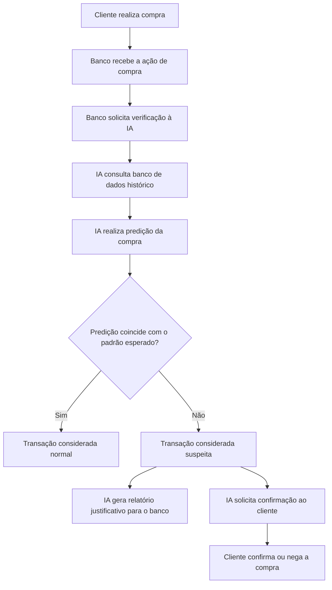

# Sentinela 1.0 — Sistema Colaborativo de Detecção de Fraude com React Agent + RAG

Este projeto é um **sistema colaborativo com IA preditiva + RAG (Retrieval-Augmented Generation)**, desenvolvido com **LangGraph**, **LangChain** e **Ollama**.

O objetivo do sistema é auxiliar um banco na detecção de possíveis fraudes em transações bancárias, PIX ou compras online, consultando:
- Banco de dados histórico de clientes
- **Políticas antifraude do banco (RAG)**
- **Relatórios históricos de fraude (RAG)**

---

## 🎯 Objetivo do projeto

O sistema simula o seguinte fluxo:

1. O cliente realiza uma compra.
2. O banco solicita que a IA verifique a transação.
3. A IA consulta múltiplas fontes:
   - Banco de dados simulado com histórico do cliente
   - **Políticas antifraude (busca semântica)**
   - **Relatórios históricos (busca semântica)**
4. A IA prediz se a transação parece normal ou suspeita.
5. Se a transação coincidir com o padrão esperado, ela é considerada normal.
6. Se a transação não coincidir com o padrão esperado, ela é considerada suspeita.
7. Em caso de suspeita, o sistema:
   - Consulta políticas para validar limites
   - Compara com fraudes históricas
   - Solicita confirmação ao cliente
   - Gera relatório justificativo para o banco

---

## 🆕 Novo: Sistema RAG Integrado

### Dois documentos de conhecimento:

**1. `politicas_antifraude.txt`** (RAG)
- Definições de fraude
- Limites de transação por perfil
- Indicadores de risco com scores
- Padrões de uso esperados (horários, locais)
- Procedimentos de verificação
- Períodos de risco elevado
- Recuperação pós-fraude

**2. `relatorios_fraude.txt`** (RAG)
- 12 casos reais de fraude documentados
- Tipos: identidade, cartão clonado, social engineering
- Padrões detectados no histórico
- Falsos positivos (viagens, novas compras)
- Lições aprendidas

### Ferramentas RAG do Agent:

```python
- consultar_politicas_antifraude(pergunta)  # Busca semântica em políticas
- consultar_relatorios_fraude(pergunta)     # Busca em histórico de fraudes
```

### Exemplos de uso:

```
User: "Qual é o limite de PIX para cliente Premium?"
Agent: [consultar_politicas_antifraude]
Resposta: "Limite de transferência PIX para Premium é R$ 100.000 por transação..."

---

User: "Houve fraude com mudança de localização geográfica?"
Agent: [consultar_relatorios_fraude]
Resposta: "Sim! Relatório #001: tentativa em Manaus bloqueada. Score 92 (CRÍTICO)..."
```

### Tecnologia RAG:

- ✓ Chroma Vector Store (persistente em `./vdb/`)
- ✓ Embeddings Ollama (`nomic-embed-text`)
- ✓ Busca semântica com similaridade
- ✓ Chunks de 800 caracteres com 200 de sobreposição
- ✓ Top-5 resultados por query

---

## 📚 Documentação

Leia os arquivos de documentação:

- **[RAG_DOCUMENTATION.md](RAG_DOCUMENTATION.md)** - Guia completo do sistema RAG
- **[IMPLEMENTATION_SUMMARY.md](IMPLEMENTATION_SUMMARY.md)** - Resumo técnico da implementação

---

## Tecnologias utilizadas

- Python 3.8+
- LangGraph (React Agent pattern)
- LangChain 0.1+ (com langchain-text-splitters moderno)
- LangChain Ollama
- **Chroma (Vector Store)**
- Ollama com modelo `qwen2.5:3b`
- Ubuntu Linux

---

## Estrutura do projeto

```bash
Colaborativos/
├── Colaborativo1.0.py              # Agent RAG principal ✨
├── 05_rag_agent.py                 # Exemplo básico
├── politicas_antifraude.txt        # Documento RAG: políticas
├── relatorios_fraude.txt           # Documento RAG: histórico
├── README.md                       # Este arquivo
├── RAG_DOCUMENTATION.md            # Guia RAG
├── IMPLEMENTATION_SUMMARY.md       # Resumo técnico
├── vdb/                            # Vector database (Chroma) - criado ao rodar
└── .venv/                          # Virtual environment
```

Os arquivos principais são:

```bash
Colaborativo1.0.py    # Agent com RAG integrado
politicas_antifraude.txt     # Dados: políticas
relatorios_fraude.txt        # Dados: histórico de fraudes
```

---

## Instalação no Ubuntu

### 1. Criar a pasta do projeto

```bash
mkdir Colaborativos
cd Colaborativos
```

Caso a pasta já exista:

```bash
cd ~/Área\ de\ trabalho/Colaborativos
```

---

### 2. Criar e ativar o ambiente virtual

```bash
python3 -m venv .venv
source .venv/bin/activate
```

Se o ambiente estiver ativo, o terminal mostrará algo parecido com:

```bash
(.venv) user@user-ubuntu:~/Área de trabalho/Colaborativos$
```

---

### 3. Instalar as dependências Python

Para o sistema com RAG integrado:

```bash
pip install langgraph langchain langchain-ollama langchain-community langchain-chroma langchain-text-splitters chromadb
```

Ou minimamente (sem RAG de PDFs):

```bash
pip install langgraph langchain langchain-ollama
```

---

## Instalação do Ollama no Ubuntu


### 1. Baixar o Ollama manualmente

Entre na pasta do usuário:

```bash
cd /home/user
```

Baixe o pacote do Ollama:

```bash
curl -L https://github.com/ollama/ollama/releases/download/v0.5.7/ollama-linux-amd64.tgz -o ollama-linux-amd64.tgz
```

Confira se o download foi feito corretamente:

```bash
ls -lh ollama-linux-amd64.tgz
file ollama-linux-amd64.tgz
```

O arquivo deve ter aproximadamente `1,6G` e aparecer como arquivo gzip.

---

### 2. Extrair o Ollama no `/home`

```bash
mkdir -p /home/user/ollama
tar -C /home/user/ollama -xzf /home/rafael/ollama-linux-amd64.tgz
```

Teste se o binário foi instalado:

```bash
/home/user/ollama/bin/ollama -v
```

É normal aparecer um aviso dizendo que não existe uma instância do Ollama rodando ainda:

```bash
Warning: could not connect to a running Ollama instance
Warning: client version is 0.5.7
```

Isso significa que o cliente foi instalado corretamente, mas o servidor ainda não foi iniciado.

---

### 3. Configurar o PATH e a pasta dos modelos

Crie a pasta onde os modelos serão armazenados:

```bash
mkdir -p /home/user/ollama-models
```

Adicione o Ollama ao PATH:

```bash
echo 'export PATH="/home/user/ollama/bin:$PATH"' >> ~/.bashrc
echo 'export OLLAMA_MODELS="/home/user/ollama-models"' >> ~/.bashrc
source ~/.bashrc
```

Verifique:

```bash
which ollama
ollama -v
```

O comando abaixo deve retornar algo parecido com:

```bash
/home/user/ollama/bin/ollama
```

---

## Baixando o modelo de IA

Este projeto utiliza o modelo:

```bash
qwen2.5:3b
```

Antes de baixar o modelo, inicie o servidor do Ollama em um terminal separado.

---

### Terminal 1: iniciar o servidor do Ollama

```bash
OLLAMA_MODELS=/home/user/ollama-models ollama serve
```

Deixe esse terminal aberto.

---

### Terminal 2: baixar o modelo

Em outro terminal:

```bash
source ~/.bashrc
OLLAMA_MODELS=/home/user/ollama-models ollama pull qwen2.5:3b
```

Depois, teste o modelo:

```bash
OLLAMA_MODELS=/home/user/ollama-models ollama run qwen2.5:3b
```

Digite algo como:

```text
Olá, você está funcionando?
```

Para sair do chat do Ollama:

```text
/bye
```

---

## Como executar o programa

Com o servidor do Ollama ainda rodando no Terminal 1, abra outro terminal e execute:

```bash
cd ~/Área\ de\ trabalho/Colaborativos
source .venv/bin/activate
python Colaborativo1.0.py
```

A saída esperada será parecida com:

```text
Sistema colaborativo de detecção de fraude iniciado.
Paradigma de IA: IA preditiva.
Digite 'sair' para encerrar.

Usuário:
```

---

## Como testar o sistema

### Teste 1 — Transação normal

Digite:

```text
O banco deseja verificar uma compra do cliente Joao no valor de 80 reais, na cidade de Sao Carlos, categoria mercado, no horário diurno.
```

Resultado esperado:

```text
A transação deve ser classificada como normal, pois coincide com o padrão histórico do cliente.
```

---

### Teste 2 — Transação suspeita

Digite:

```text
O banco deseja verificar uma compra do cliente Joao no valor de 5000 reais, na cidade de Dubai, categoria eletronicos, no horário noturno.
```

Resultado esperado:

```text
A transação deve ser classificada como suspeita.
```

O agente deve justificar a decisão com fatores como:

- cidade diferente do padrão;
- valor muito acima da média;
- categoria incomum;
- horário diferente do padrão.

Além disso, o sistema deve:

- solicitar confirmação ao cliente;
- gerar relatório para o banco.

---

### Teste 3 — Consultar banco de dados

Digite:

```text
Mostre o banco de dados com os relatórios e confirmações registradas.
```

Resultado esperado:

```text
O agente deve mostrar os perfis dos clientes, os relatórios registrados e as confirmações enviadas.
```

---

### Teste 4 — Encerrar o programa

Digite:

```text
sair
```

---

## Ferramentas implementadas

O sistema possui quatro ferramentas principais.

---

### 1. `verificar_transacao`

Verifica se uma transação bancária, PIX ou compra online é suspeita.

A ferramenta analisa:

- cliente;
- valor;
- cidade;
- categoria;
- horário.

Ela retorna:

- ação predita;
- pontuação de risco;
- classificação da transação;
- justificativa da decisão.

---

### 2. `gerar_relatorio_banco`

Gera um relatório para o banco com os dados da transação e os motivos que levaram à classificação.

O relatório inclui:

- cliente;
- valor;
- cidade;
- categoria;
- horário;
- pontuação de risco;
- classificação;
- fatores considerados pela IA.

---

### 3. `solicitar_confirmacao_cliente`

Simula o envio de uma confirmação ao cliente.

Essa ferramenta é usada quando a IA identifica uma transação suspeita.

---

### 4. `consultar_banco_de_dados`

Consulta o banco de dados simulado do sistema.

Ela mostra:

- perfis históricos dos clientes;
- relatórios de fraude registrados;
- confirmações pendentes enviadas aos clientes.

---

## Fluxo do React Agent

O sistema segue o padrão de comportamento de um React Agent.

O agente decide, a cada interação, se deve:

1. responder diretamente ao usuário;
2. chamar uma ferramenta;
3. receber o resultado da ferramenta;
4. continuar o raciocínio;
5. retornar uma resposta final.

Fluxo simplificado:



---

## Relação com sistemas colaborativos

O sistema envolve colaboração entre três elementos principais:

- Banco;
- Cliente;
- IA preditiva.

---

### Comunicação

A comunicação ocorre quando o banco envia uma transação para ser verificada e quando o sistema retorna uma resposta ao banco ou solicita confirmação ao cliente.

---

### Coordenação

A coordenação aparece no fluxo de decisão da IA, que organiza as etapas de verificação, classificação, geração de relatório e solicitação de confirmação.

---

### Cooperação

A cooperação ocorre porque o banco, o cliente e a IA contribuem para a decisão final. O banco fornece os dados da transação, a IA realiza a análise preditiva e o cliente pode confirmar ou negar uma transação suspeita.

---

## Observações importantes

Este projeto é apenas um protótipo inicial.

O banco de dados utilizado é simulado em memória, usando estruturas Python como dicionários e listas.

Isso significa que os dados registrados durante a execução são perdidos quando o programa é encerrado.

Em versões futuras, o sistema pode ser expandido com:

- banco de dados real;
- interface web;
- autenticação de usuários;
- histórico persistente de transações;
- modelos reais de machine learning;
- dashboard para o banco;
- confirmação real por e-mail, SMS ou aplicativo.

---

## Problemas comuns

### Erro: `ollama: command not found`

Significa que o terminal não encontrou o executável do Ollama.

Tente:

```bash
source ~/.bashrc
which ollama
```

Se ainda não funcionar, adicione novamente ao PATH:

```bash
echo 'export PATH="/home/user/ollama/bin:$PATH"' >> ~/.bashrc
source ~/.bashrc
```

---

### Erro: `could not connect to a running Ollama instance`

Significa que o servidor do Ollama não está rodando.

Inicie com:

```bash
OLLAMA_MODELS=/home/user/ollama-models ollama serve
```

---

### Erro: modelo não encontrado

Se aparecer erro dizendo que o modelo `qwen2.5:3b` não existe localmente, rode:

```bash
OLLAMA_MODELS=/home/user/ollama-models ollama pull qwen2.5:3b
```

---

### Partição `/` cheia

Se o root encher durante a instalação, verifique com:

```bash
df -h
```

Caso uma instalação parcial do Ollama tenha ocupado espaço em `/usr/local`, remova com cuidado:

```bash
sudo systemctl stop ollama 2>/dev/null
sudo systemctl disable ollama 2>/dev/null

sudo rm -rf /usr/local/lib/ollama
sudo rm -f /usr/local/bin/ollama
sudo rm -f /etc/systemd/system/ollama.service

sudo systemctl daemon-reload
df -h
```

---

## Autor

Projeto desenvolvido como protótipo inicial para atividade de sistemas colaborativos com agentes do tipo React Agent.

```text
Sistema: Colaborativo 1.0
Paradigma de IA: IA preditiva
Cenário: Detecção de fraude bancária
```
