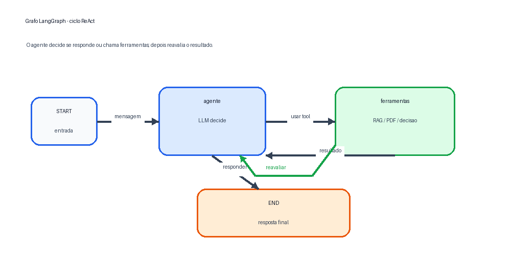

# Sentinela 1.0 - Sistema colaborativo com LangGraph, RAG e Streamlit

## Cenário colaborativo

O Sentinela 1.0 simula um ambiente colaborativo de prevenção a fraude bancária. Os participantes são:

- **Banco**: envia transações para análise, consulta documentos e toma decisões operacionais.
- **Cliente/Conta**: recebe solicitações de confirmação e responde se reconhece ou não uma transação.
- **Agente de IA**: usa LangGraph, ferramentas e RAG para consultar documentos, analisar contexto e apoiar decisões.

O objetivo é permitir que o banco e o cliente troquem informações mediadas pelo sistema enquanto o agente consulta documentos e gera respostas ou recomendações baseadas em evidências.

## O que o sistema faz

- Analisa transações bancárias com regras de risco e modelos treinados.
- Permite cidades/localizações novas digitadas livremente na interface.
- Registra mensagens entre Banco, Cliente e Agente.
- Registra eventos colaborativos e decisões operacionais.
- Consulta documentos internos de políticas e relatórios usando RAG.
- Permite upload e consulta de até **5 documentos PDF** por RAG.
- Permite conversar com o agente para discutir documentos e gerar respostas baseadas neles.
- Mantém relatórios de análise e reanálise após resposta do cliente.

## Modelo 3C

### Comunicação

A comunicação aparece nas mensagens mediadas entre Banco e Cliente, no chat com o Agente e nos registros de eventos. Cada mensagem possui origem, destino, cliente relacionado e texto.

Exemplos no sistema:

- Banco envia mensagem para uma conta.
- Cliente confirma ou nega uma compra.
- Banco conversa com o agente sobre políticas, relatórios ou PDFs.

### Colaboração

A colaboração ocorre quando Banco, Cliente e Agente contribuem para a decisão:

- o Banco informa a transação e consulta documentos;
- o Agente analisa risco, recupera contexto via RAG e gera recomendações;
- o Cliente confirma ou contesta uma transação suspeita;
- o sistema recalcula risco e registra relatório final.

### Coordenação

A coordenação aparece no fluxo de estados da transação:

- `aguardando decisão do banco`;
- `aguardando resposta do cliente`;
- `finalizada`.

O sistema também bloqueia ações transacionais quando há confirmação pendente e registra o histórico de eventos para acompanhar a sequência da colaboração.

## LangGraph

O fluxo principal é modelado com LangGraph em `app.py`:



Resumo do ciclo: `START -> agente -> ferramentas -> agente -> END`. O agente decide se responde diretamente ou se chama uma ferramenta; depois do resultado da ferramenta, ele reavalia o contexto.

Nós:

- `agente`: nó principal com LLM e instruções do sistema.
- `ferramentas`: `ToolNode` com ferramentas de análise, consulta e RAG.
- `retorno_cliente`: nó interno de retorno para permitir o ciclo de reavaliação.

Ferramentas principais:

- `verificar_transacao`
- `gerar_relatorio_banco`
- `solicitar_confirmacao_cliente`
- `contestar_transacao_cliente`
- `consultar_politicas_antifraude`
- `consultar_relatorios_fraude`
- `consultar_documentos_pdf`
- `consultar_banco_de_dados`
- `consultar_base_de_modelos`
- `verificar_transacao_modelo`
- `verificar_transacao_modelo_por_id`

## RAG

O sistema usa Chroma e embeddings do Ollama (`nomic-embed-text`) para recuperar trechos relevantes.

Fontes de conhecimento:

- `politicas_antifraude.txt`: políticas, limites, indicadores de risco e procedimentos.
- `relatorios_fraude.txt`: casos históricos, padrões e lições aprendidas.É atualizado a cada transação confirmada ou negada pelo cliente.
- PDFs enviados pela interface Streamlit na aba **Agente**.

Parâmetros atuais:

- chunks de 800 caracteres;
- sobreposição de 200 caracteres;
- top 5 trechos por consulta;
- persistência em `vdb/`.

Se o RAG vetorial não estiver disponível para os arquivos `.txt`, o sistema usa busca textual local como fallback.

## Estrutura do projeto

```text
.
├── app.py                         # Aplicação Streamlit, LangGraph, tools e RAG
├── modelos_dados.py               # Carregamento da base, perfis e modelos treinados
├── test_agente_fraude.py          # Testes automatizados
├── politicas_antifraude.txt       # Documento interno de políticas
├── relatorios_fraude.txt          # Documento interno de relatórios históricos
├── dados/
│   ├── bank_transactions_data_2.csv
│   ├── perfis_clusters.csv
│   └── transacoes_clusterizadas.csv
├── modelos/
│   ├── modelo_cluster.pkl
│   └── modelo_isolation_forest.pkl
├── documentos_pdf/                # Criado ao salvar PDFs enviados pela interface
├── vdb/                           # Banco vetorial 
└── grafo_langgraph.png
```

## Requisitos

- Python 3.10 ou superior.
- Ollama instalado e rodando localmente.
- Modelos Ollama:
  - `qwen2.5-coder:3b` para o agente;
  - `nomic-embed-text` para embeddings do RAG.

Dependências Python:

```bash
pip install streamlit langgraph langchain langchain-ollama langchain-community langchain-chroma langchain-text-splitters chromadb pandas scikit-learn joblib ipython pypdf
```

## Como rodar localmente

1. Entre na pasta do projeto:

```bash
cd /home/gabi/Downloads/versaoalamo
```

2. Crie e ative um ambiente virtual:

```bash
python3 -m venv .venv
source .venv/bin/activate
```

3. Instale as dependências:

```bash
pip install streamlit langgraph langchain langchain-ollama langchain-community langchain-chroma langchain-text-splitters chromadb pandas scikit-learn joblib ipython pypdf
```

4. Inicie o Ollama em outro terminal:

```bash
ollama serve
```

5. Baixe os modelos, se ainda não existirem:

```bash
ollama pull qwen2.5-coder:3b
ollama pull nomic-embed-text
```

6. Rode a aplicação:

```bash
streamlit run app.py
```

7. Abra no navegador:

```text
http://localhost:8501
```

Se houver problema de cache do Hugging Face ou Chroma sem permissão de escrita, rode:

```bash
HF_HOME=/tmp/huggingface TRANSFORMERS_CACHE=/tmp/huggingface streamlit run app.py
```

## Como usar

### Banco

1. Abra a aba **Banco**.
2. Escolha uma conta.
3. Digite valor, cidade/localização, tipo, canal e demais campos.
4. Clique em **Enviar transação ao agente**.
5. Avalie a recomendação e escolha:
   - autorizar compra;
   - não autorizar;
   - pedir confirmação ao cliente.

A cidade/localização é campo livre: é possível informar cidades novas que não existem na base original.

### Cliente

1. Abra a aba **Cliente**.
2. Escolha a conta.
3. Veja mensagens e solicitações pendentes.
4. Confirme ou negue a transação.

Após a resposta, o sistema recalcula o risco e gera um relatório final.

### PDFs e documentos

1. Abra a aba **Agente**.
2. Em **Base de conhecimento RAG**, envie até 5 PDFs.
3. Clique em **Salvar PDFs para RAG**.
4. Use **Consultar PDFs** para recuperar trechos relevantes.
5. Use **Discutir PDFs com agente** para gerar uma resposta baseada nos trechos recuperados.

Na mesma aba também é possível consultar:

- políticas antifraude;
- relatórios históricos de fraude;
- chat geral com o agente.

### Chat com o agente

Use o chat da aba **Agente** para pedir:

- resumo da mediação;
- análise de uma transação;
- consulta às políticas;
- comparação com relatórios históricos;
- discussão de PDFs enviados.

## Testes

Execute:

```bash
python3 -m pytest test_agente_fraude.py -q
```

Resultado atual validado:

```text
15 passed
```
Autores:
Gabriela Passos de Andrade 12625142
Rafael Cunha Bejes Learth 13676367
Erik Reis de Oliveira Santos 16864139
